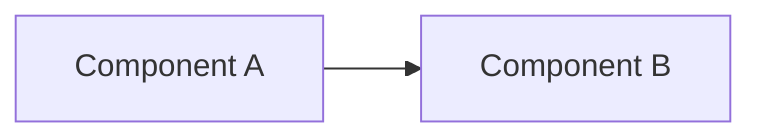

# {프로젝트명}

> 복사 후 다음 항목을 실제 정보로 교체하세요.

## 📌 프로젝트 메타정보

| 항목 | 내용 |
|---|---|
| **고객사** | {고객사명} |
| **시스템명** | {시스템명} |
| **계약 기간** | {YYYY-MM-DD ~ YYYY-MM-DD} |
| **역할** | {AI 시스템 아키텍트 / 개발 / PM 등} |
| **주요 이해관계자** | {고객사 PM, MCNC PM, 기술리더 등} |

## 🎯 프로젝트 목적 (1-2 문장)

{이 프로젝트가 무엇을 해결하는지 간결하게}

## 🗺️ 빠른 네비게이션

Claude에게 이 프로젝트 맥락을 빠르게 주입하려면 다음 순서로 읽히세요:

1. **`_MANIFEST.md`** — 전체 파일 맵과 Tier 분류
2. **`CLAUDE.md`** — Claude 행동 지침
3. **`docs/_MANIFEST.md`** — 문서 폴더 상세 맵
4. **Tier 1 핵심 문서** (`_MANIFEST.md`에 명시)

## 📂 폴더 구조

```
{프로젝트명}/
├── README.md              ← 지금 이 파일
├── CLAUDE.md              ← Claude 행동 지침
├── _MANIFEST.md           ← 전체 파일 맵 (Tier 분류)
├── PICKUP.md              ← 세션 핸드오프 (마지막 작업 요약)
└── docs/
    ├── _MANIFEST.md       ← docs 폴더 맵
    ├── specs/             ← 요구사항, 기획서, 설계서 [Tier 1]
    ├── meetings/          ← 회의록 [Tier 2]
    ├── decisions/         ← 의사결정 로그 [Tier 1]
    ├── references/        ← 외부 참조 [Tier 2]
    └── archive/           ← 구버전·폐기안 [Tier 3]
```

## 🏗️ 아키텍처 요약 (선택)

{프로젝트 아키텍처를 1-2줄로 + Mermaid 간단 다이어그램}



## 📞 연락처 / 협업 채널

- Slack: {#channel-name}
- 공유 드라이브: {링크 또는 경로}
- 원본 문서 서버: {사내 파일서버 경로}

---

**마지막 업데이트**: {YYYY-MM-DD}
